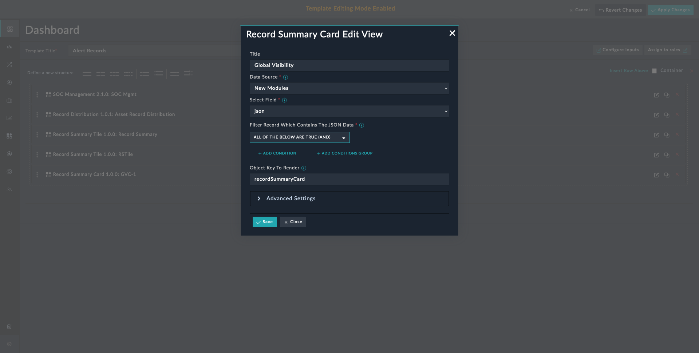

| [Home](../README.md) |
|----------------------|

# Usage

To use this widget users needs to provide a JSON in a certain format for the widget to render data. This JSON data must be in a field of a record in a module.

This widget can also *Broadcast* an event. This option can be enabled in widget configuration's *Advanced Settings*. 

This widget represents an individual record. If, however, multiple records meet the filter criteria, this widget creates a new card for each record.

<table>
    <td><strong>NOTE</strong></td>
    <td>For the widget to create multiple cards, each record's JSON field must contain data in a very specific format.</td>
</table>

If the broadcast event is turned on, the widget will then broadcast an event passing on the record IRI(Id) to the listening widgets.
The widgets listening to the on-click event should be present on the dashboard as this widget.

<table>
    <td><strong>IMPORTANT</strong></td>
    <td>The <code>JSON</code> data to be rendered must have the following:
        <ul>
            <li><code>data</code> object containing data in <em>key-value</em> format</li>
            <li><code>title</code> key containing title of the card being displayed</li>
        </ul>
    </td>
</table>

## Record Summary Card

1. Edit a *Dashboard*'s view template and select **Add Widget** button.

2. Select **Record Summary Card** from the list to bring up the **Record Summary Card** widget's edit view.

3. Specify the title of this visual representation in the **Title** field.

    

4. Select the module, whose records are to be displayed, in the **Select Data Source** field. The drop-down lists only those modules that support JSON data fields. For details on editing and creating modules, refer to the *Module Editor* section of the FortiSOAR *Administration Guide*, [here](https://docs.fortinet.com/document/fortisoar/7.4.1/administration-guide/97786/application-editor#Module_Editor).

5. Select the field, whose data is to be displayed, in the **Select Field** field. The drop-down lists fields of type `JSON`. For details on editing and creating fields, refer to the *Module Editor* section of the FortiSOAR *Administration Guide*, [here](https://docs.fortinet.com/document/fortisoar/7.4.1/administration-guide/97786/application-editor#Module_Editor).

6. Define the filter criteria using which to filter the data to be rendered by this widget.

    This widget renders multiple cards corresponding to each record meeting the following criteria:

    - Each record must meet the defined filter conditions
    - Each record has data in the field specified in the previous step
    - Each record has JSON data in correct format

    <table>
        <thead>
            <th>Example</th>
        </thead>
        <tbody>
            <td>Filters can be applied for tasks like displaying the widget with only those asset records that meet the following criteria:
                <ul>
                    <li><em>Site Type</em> is <code>Master</code></li>
                    <!-- <li>State is <em>Active</em></li> -->
                </ul>
            </td>
        </tbody>
    </table>

7. Specify the JSON `key` whose `value` is to be rendered in the **Object key to render** field.

<table>
    <thead>
        <th>Example</th>
    </thead>
    <tbody>
        <td>Consider the following JSON data in one of the record's JSON field:
            <pre>"recordSummaryCard": {
      "data": {
        "MTTD": "1 min",
        "MTTR": "2 mins",
        "Node Status": "Active",
        "Active Incidents": 0
      },
      "title": "Australia"
    }</pre>
            
The following screenshot shows the Record Summary Card in action with this JSON data.

            

            
Consider the following JSON data in each of the record's JSON field:

<ul>
    <li>
        <pre>"recordSummaryCard": {
            "data": {
            "ROI":"$37,707",
            "MTTD": "1 min",
            "MTTR": "2 mins",
            "Node Status": "Active",
            "Total Tenants":5,
            "Active Incidents": 8
            },
            "title": "Australia"
          }</pre>
    </li>
    <li>
        <pre>"recordSummaryCard": {
            "data": {
            "ROI":"$37,707",
            "MTTD": "1 min",
            "MTTR": "2 mins",
            "Node Status": "Active",
            "Total Tenants":4,
            "Active Incidents": 24
            },
            "title": "India"
          }</pre>
    </li>
    <li>
        <pre>"recordSummaryCard": {
            "data": {
            "ROI":"$37,707",
            "MTTD": "1 min",
            "MTTR": "2 mins",
            "Node Status": "Active",
            "Total Tenants":4,
            "Active Incidents": 6
            },
            "title": "Ireland"
          }</pre>
    </li>
</ul>
            
The following screenshot shows the Record Summary Card in action with this JSON data.

            

        </td>
    </tbody>
</table>

### Advanced Settings

These steps create an event to broadcast which can then be listened to by listener widgets like *Funnel Chart* widget.

1. Enable to broadcast an event.

2. Specify a name of the event for the widget to broadcast.

3. Enter a name of the event to broadcast.

    The listener widgets like *Funnel Chart* should be listening to exactly this event name.

<table>
    <tr>
        <th>IMPORTANT</th>
        <td><strong>Record Summary Card</strong> is a broadcasting widget. It broadcasts a record IRI listened to by widgets like <em>Funnel Chart</em> and <em>Top X</em> widgets. However, these widgets cannot render data until the record IRI they are listening to also contains data in their compatible format.</td>
    </tr>
</table>

| [Installation](./setup.md#installation) | [Configuration](./setup.md#configuration) |
|-----------------------------------------|-------------------------------------------|